# ISIRT-IA: Sistema de Gestión de Incidentes con Asistencia de IA

[](LICENSE)
[](https://www.python.org/downloads/)
[](https://fastapi.tiangolo.com/)

**ISIRT-IA** es una plataforma web integral diseñada para la gestión centralizada de incidentes de seguridad (CSIRT/CERT). El sistema combina flujos de trabajo tradicionales de respuesta a incidentes con potentes capacidades de **Inteligencia Artificial** y **RAG (Retrieval-Augmented Generation)** para acelerar el análisis, la clasificación y la recuperación.

Esta solución nace de la necesidad de optimizar el ciclo de vida de los incidentes de seguridad en entornos corporativos. No es solo un sistema de reporte; es una herramienta diseñada bajo los lineamientos de la ISO 27001 y el NIST SP 800-61, integrando Inteligencia Artificial para la categorización y priorización automática de amenazas.

El objetivo principal es reducir drásticamente el MTTD (Mean Time to Detect) y el MTTR (Mean Time to Respond) del equipo de respuesta a incidentes (ISIRT).

---

## 🌟 Características Destacadas

- **Gestión de Incidentes:** Ciclo de vida completo desde el registro hasta el cierre.
- **Asistente de IA (RAG):** Consulta automática de playbooks y bases de conocimiento internas para sugerir acciones de respuesta.
- **Auditoría Avanzada:** Registro inmutable de acciones críticas con sistema de alertas de seguridad proactivas.
- **Arquitectura Robusta:** Backend asíncrono con FastAPI y Frontend reactivo con React + TypeScript.
- **Seguridad:** Autenticación JWT, RBAC (Control de Acceso Basado en Roles) y protección contra ataques comunes.

---

## 🛠️ Stack Tecnológico

- **Backend:** Python 3.11, FastAPI, SQLAlchemy (PostgreSQL), Pydantic, Alembic.
- **Frontend:** React 18, TypeScript, Tailwind CSS, Vite.
- **IA:** LangChain, FAISS, Google Gemini / OpenAI / Ollama.
- **Infraestructura:** Docker & Docker Compose, Nginx.

---

## 🏗️ Arquitectura del Sistema

El proyecto sigue una arquitectura desacoplada para garantizar escalabilidad y seguridad:

- **Frontend:** Interfaz reactiva en React para la gestión visual y reportes en tiempo real.
- **Backend:** API REST robusta construida con FastAPI, priorizando la velocidad y el tipado fuerte con Pydantic.
- **AI Engine:** Integración con modelos de lenguaje para el análisis sintáctico de los reportes y sugerencia de planes de remediación.
- **Database:** Persistencia de incidentes con trazabilidad de auditoría (quién, cuándo y qué se modificó).

### 📊 Diagrama de Arquitectura y Flujo de Incidentes

```mermaid
flowchart TB
    subgraph Usuarios["👥 Usuarios"]
        A[Analista de Seguridad]
        B[Miembro IRT]
        C[Administrador]
    end

    subgraph Frontend["🖥️ Frontend (React + TypeScript)"]
        D[Dashboard de Incidentes]
        E[Formulario de Reporte]
        F[Chatbot IA]
    end

    subgraph Backend["⚙️ Backend (FastAPI)"]
        G[API REST /api/v1/*]
        H[Servicios de Negocio]
        I[Autenticación JWT]
    end

    subgraph AI_Engine["🤖 Motor de IA"]
        J[RAG Processor]
        K[FAISS Vector Store]
        L[Gemini / OpenAI / Ollama]
    end

    subgraph Data["💾 Capa de Datos"]
        M[(PostgreSQL)]
        N[Audit Log]
        O[Knowledge Base]
    end

    A --> D
    B --> D
    C --> D
    
    D --> G
    E --> G
    F --> G
    
    G --> H
    G --> I
    
    H --> J
    J --> K
    J --> L
    K --> O
    
    H --> M
    H --> N
    
    I --> M
```



### 🔄 Flujo de Incidentes con IA

```mermaid
sequenceDiagram
    participant U as 👤 Usuario
    participant F as 🖥️ Frontend
    participant B as ⚙️ Backend API
    participant RAG as 🤖 RAG Engine
    participant AI as 🧠 LLM (Gemini/OpenAI)
    participant DB as 💾 PostgreSQL

    Note over U,DB: 1. Reporte de Incidente
    U->>F: Describe incidente
    F->>B: POST /incidents/suggestions
    B->>RAG: Buscar playbooks similares
    RAG->>DB: Consultar Knowledge Base
    DB-->>RAG: Documentos relevantes
    RAG->>AI: Prompt enriquecido + contexto
    AI-->>B: Sugerencias (categoría, severidad, recomendaciones)
    B-->>F: JSON con sugerencias
    F-->>U: Muestra sugerencias para revisión
    
    Note over U,DB: 2. Creación del Incidente
    U->>F: Confirma/Modifica datos
    F->>B: POST /incidents/
    B->>DB: Crear incidente
    B->>DB: Registrar en Audit Log
    DB-->>B: Incidente creado
    B-->>F: Confirmación
    F-->>U: Incidente registrado

    Note over U,DB: 3. Asistencia con Chatbot
    U->>F: Consulta sobre incidente
    F->>B: POST /chatbot/ask
    B->>DB: Recuperar historial
    B->>RAG: Buscar contexto relevante
    RAG->>AI: Prompt con memoria
    AI-->>B: Respuesta contextualizada
    B->>DB: Guardar conversación
    B-->>F: Respuesta del asistente
    F-->>U: Muestra respuesta IA
```



---

## 🚀 Instalación y Despliegue (Quick Start)
Requisitos previos
Docker y Docker Compose

Python 3.10+

Clonar y Levantar

```bash
git clone https://github.com/franRestrpo/incidentes_isirt_ia.git
cd incidentes_isirt_ia
# Crear archivo de variables de entorno
cp .env.example .env 
# Levantar servicios
docker-compose up -d
```

Para instrucciones detalladas sobre instalación local, configuración avanzada y resolución de problemas, consulta la:
👉 **[Guía Completa de Despliegue y Troubleshooting](docs/DESPLIEGUE_TROUBLESHOOTING.md)**.

---

## 📚 Documentación

- [Arquitectura del Sistema](docs/ARQUITECTURA_SISTEMA.md)
- [Esquema de Base de Datos](docs/DOCUMENTO_BASE_DE_DATOS.md)
- [Guía de Gestión de Conocimiento (RAG)](docs/GUIA_GESTION_CONOCIMIENTO_RAG.md)
- [Manual de Auditoría y Monitoreo](docs/LOGGING_MONITORING_GUIDE.md)

---

## 🤝 Contribución

¡Las contribuciones son bienvenidas! Si deseas mejorar el sistema:
1. Haz un Fork del proyecto.
2. Crea una rama para tu característica (`git checkout -b feature/NuevaMejora`).
3. Realiza tus cambios y haz commit (`git commit -m 'Añade nueva mejora'`).
4. Haz Push a la rama (`git push origin feature/NuevaMejora`).
5. Abre un Pull Request.

---

## ⚖️ Licencia

Este proyecto está bajo la Licencia **GNU General Public License v3.0 (GPLv3)**. Consulta el archivo [LICENSE](LICENSE) para más detalles.

---

## 👤 Autor

**Fran Estuwar Restrepo Cuellar**  
Cybersecurity Professional | GRC | DevSecOps

- [LinkedIn](https://www.linkedin.com/in/franrestrepo/)
- 📧 Email: franrestrepo@example.com

---
*Desarrollado para equipos de respuesta a incidentes que buscan potenciar su eficiencia mediante IA.*
