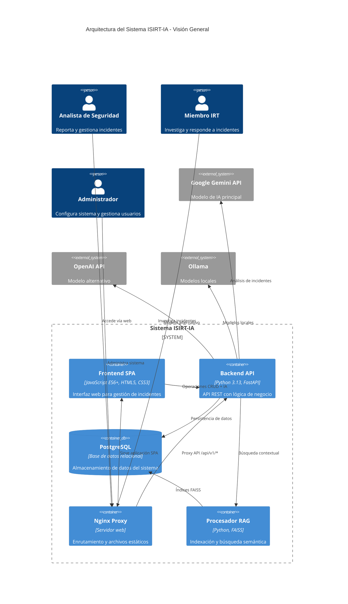
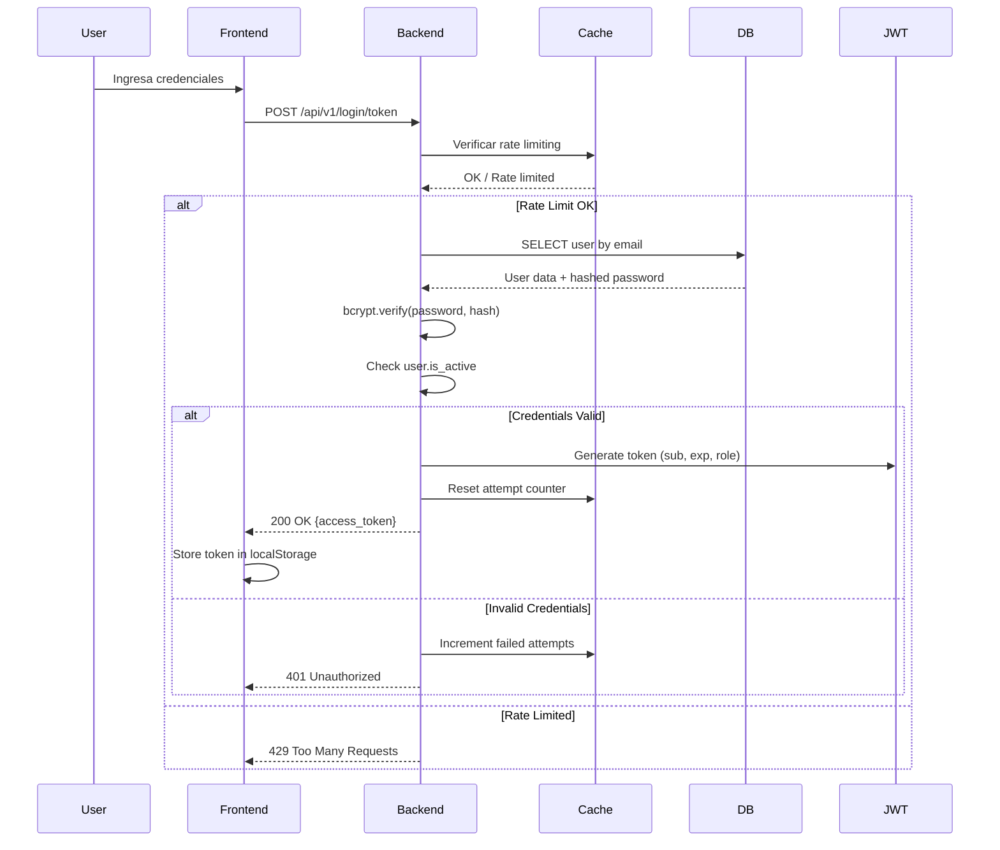
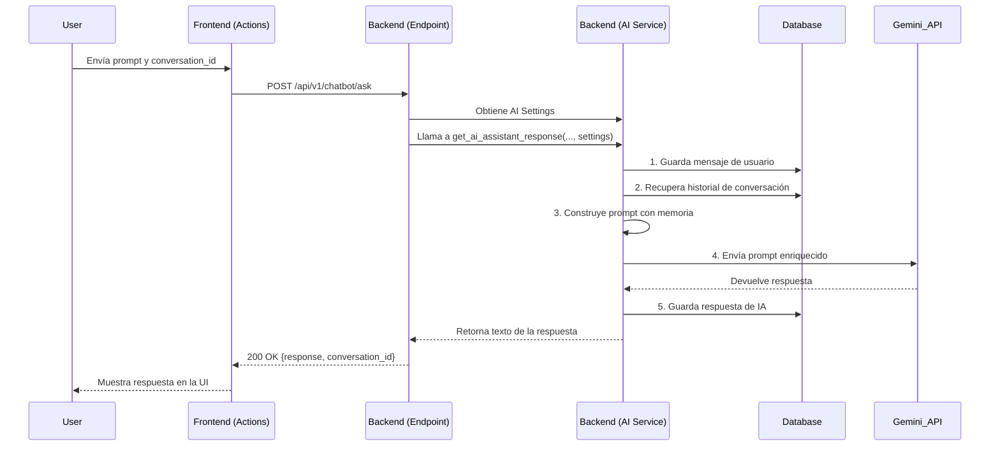
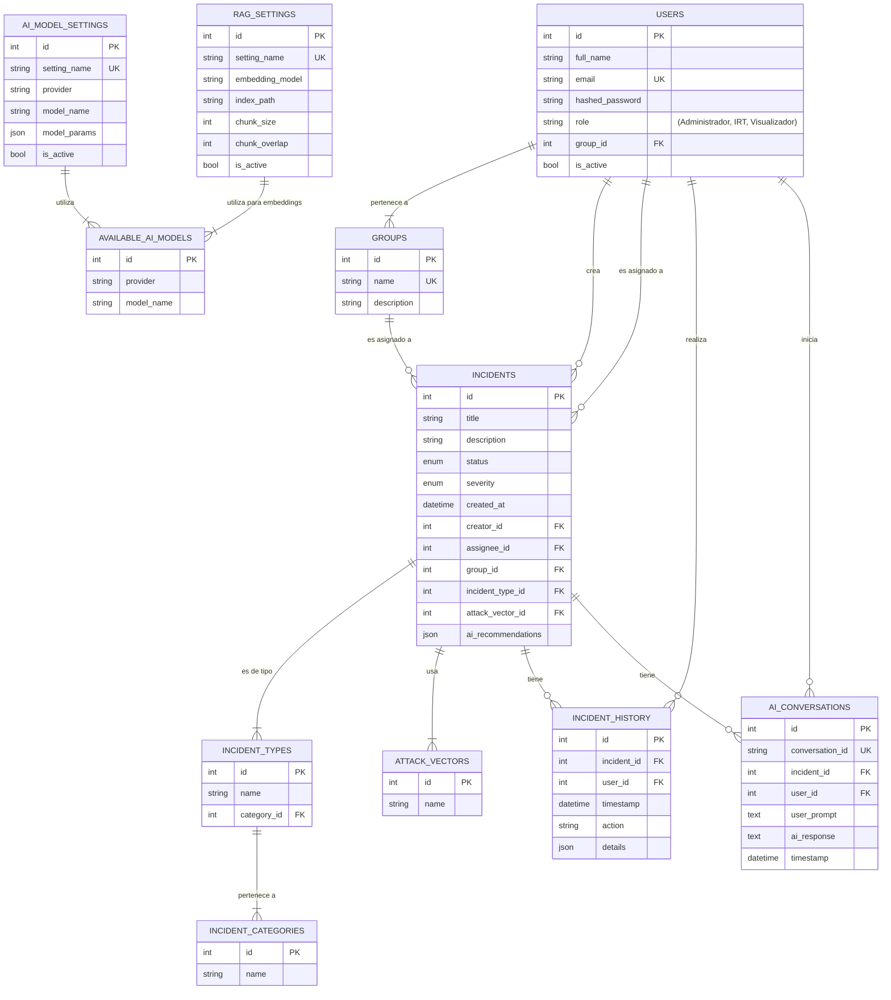
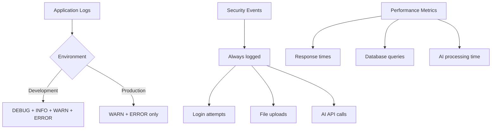
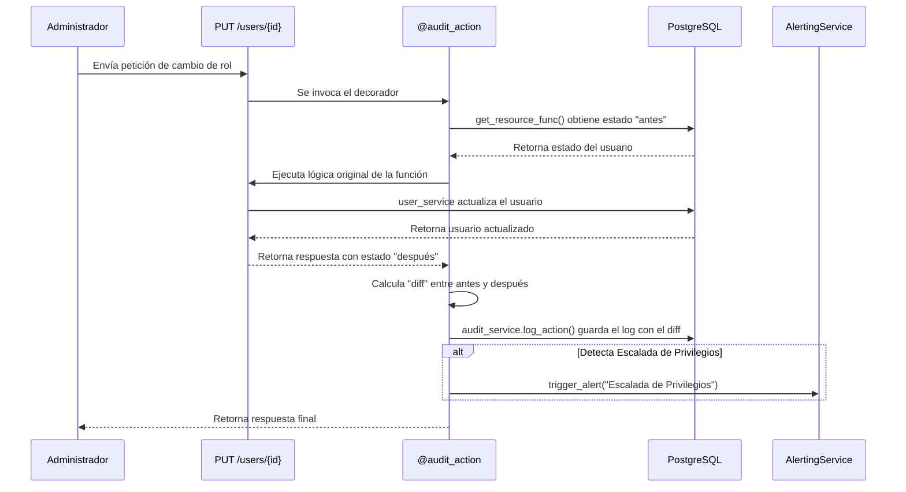

# Arquitectura del Sistema ISIRT-IA - Documento Consolidado

## Información General

Este documento describe la arquitectura completa del **Sistema de Gestión de Incidentes con Asistencia de IA (ISIRT-IA)**, actualizado después de las mejoras de seguridad y refactorización realizadas.

## 1. Visión General del Sistema

ISIRT-IA es una plataforma web full-stack que combina:
- **Gestión tradicional de incidentes** siguiendo marcos como NIST y ISO 27001
- **Asistencia inteligente con IA** para acelerar análisis y respuesta
- **Arquitectura de microservicios** contenerizada con Docker
- **Sistema RAG** para contextualizar respuestas con base de conocimiento

## 2. Arquitectura de Alto Nivel

El sistema sigue una arquitectura de componentes desacoplados, compuesta por cuatro partes principales que se comunican a través de redes y APIs.

-   **Frontend (Cliente)**: Una aplicación de una sola página (SPA) escrita en JavaScript puro. Es responsable de toda la interfaz de usuario.
-   **Nginx (Proxy Inverso)**: Actúa como punto de entrada. Sirve los archivos estáticos del frontend y redirige las solicitudes de API al backend.
-   **Backend (Servidor API)**: Una API RESTful construida con FastAPI (Python). Maneja la lógica de negocio, autenticación y comunicación con la base de datos y servicios externos.
-   **Base de Datos (Persistencia)**: Una base de datos PostgreSQL que almacena toda la información del sistema.



## 3. Desglose de Componentes

### 3.1. Frontend (`/react_frontend`)
SPA construida con **React y TypeScript**. Su diseño es modular y separa responsabilidades:
-   **`src/services/apiService.ts`**: Centraliza todas las llamadas `fetch` a la API del backend.
-   **`src/pages/`**: Orquesta la lógica de negocio del cliente. Llama a `apiService.ts` y procesa las respuestas para actualizar la UI.
-   **`src/components/`**: Componentes de React que manipulan el DOM para mostrar las vistas.
-   **`src/router/`**: Maneja el enrutamiento del lado del cliente.

### 3.2. Nginx (`/nginx`)
Actúa como "portero", con dos roles principales:
1.  **Servidor de Archivos Estáticos**: Sirve el frontend (HTML, CSS, JS).
2.  **Proxy Inverso**: Redirige cualquier solicitud a `/api/...` al backend, resolviendo problemas de CORS.

### 3.3. Backend (`/incident_api`)
Construido con **FastAPI**, sigue una arquitectura por capas:
1.  **Capa de API (`/api/v1/endpoints`)**: Expone los endpoints HTTP. Valida datos de entrada con Pydantic y llama a la capa de servicios. Aquí se encuentra el endpoint dedicado `chatbot.py`.
2.  **Capa de Servicios (`/services`)**: Orquesta la lógica de negocio. `ai_service.py` contiene la lógica para interactuar con la IA.
3.  **Capa de Acceso a Datos (CRUD) (`/crud`)**: Abstrae las operaciones directas con la base de datos.
4.  **Capa de Modelos (`/models`)**: Define la estructura de las tablas de la base de datos con SQLAlchemy.
5.  **Capa de Esquemas (`/schemas`)**: Define los contratos de datos de la API con Pydantic. Incluye `chatbot.py` para los esquemas de petición y respuesta de la IA.

```mermaid
C4Container
  title Arquitectura por Capas - Backend ISIRT-IA

  Boundary(api_layer, "Capa de API") {
    Container(endpoints, "Endpoints REST", "FastAPI", "Exponen operaciones CRUD y IA")
    Container(dependencies, "Dependencias", "FastAPI", "Autenticación, validación, inyección")
    Container(middleware, "Middleware", "FastAPI", "CORS, logging, error handling")
    Container(security, "Seguridad", "FastAPI", "JWT, rate limiting, file security")
  }

  Boundary(service_layer, "Capa de Servicios") {
    Container(incident_svc, "IncidentService", "Python", "Lógica de negocio de incidentes")
    Container(ai_svc, "AIService", "Python", "Integración con modelos de IA")
    Container(user_svc, "UserService", "Python", "Gestión de usuarios y autenticación")
    Container(rag_svc, "RAGService", "Python", "Procesamiento de documentos")
    Container(chat_svc, "ChatService", "Python", "Sistema de conversación con IA")
  }

  Boundary(data_layer, "Capa de Datos") {
    Container(crud_ops, "CRUD Operations", "SQLAlchemy", "Operaciones de BD")
    Container(models, "Modelos", "SQLAlchemy", "Definición de tablas")
    Container(schemas, "Esquemas", "Pydantic", "Validación y serialización")
    Container(migrations, "Alembic", "Migraciones", "Versionado de esquema BD")
  }

  Boundary(infra_layer, "Capa de Infraestructura") {
    ContainerDb(postgres, "PostgreSQL", "Base de datos")
    Container(faiss, "FAISS Index", "Búsqueda vectorial")
    Container(redis, "Redis Cache", "Caché opcional")
    Container(filesystem, "File System", "Archivos de evidencia")
  }

  Rel(endpoints, incident_svc, "Orquesta operaciones")
  Rel(endpoints, ai_svc, "Invoca análisis IA")
  Rel(endpoints, user_svc, "Gestiona autenticación")
  Rel(endpoints, chat_svc, "Maneja conversaciones IA")

  Rel(incident_svc, crud_ops, "Persistencia")
  Rel(ai_svc, rag_svc, "Enriquecimiento contextual")
  Rel(chat_svc, crud_ops, "Historial de conversaciones")

  Rel(crud_ops, models, "ORM mapping")
  Rel(crud_ops, postgres, "SQL queries")
  Rel(crud_ops, migrations, "Schema versioning")

  Rel(rag_svc, faiss, "Índice vectorial")
  Rel(ai_svc, gemini, "API externa")
  Rel(security, filesystem, "Archivos seguros")
```

## 4. Flujos de Trabajo Principales

### 4.1. Flujo: Autenticación de Usuario

Este flujo detalla cómo un usuario inicia sesión y obtiene un token de acceso para realizar solicitudes seguras.

1.  **Frontend (Petición)**: El usuario introduce su email y contraseña en el formulario de login. La acción `loginUser` en `authActions.js` empaqueta estos datos y los envía vía `api.js` al endpoint `/api/v1/login/access-token`.
2.  **Nginx (Redirección)**: Nginx recibe la solicitud y, al ver que la ruta comienza con `/api/`, la redirige al contenedor del backend.
3.  **Backend (Validación)**: El endpoint de login en FastAPI recibe las credenciales. El servicio de usuario (`user_service`) busca al usuario por su email y utiliza `hashing.verify_password` para comparar la contraseña proporcionada con el hash almacenado en la base de datos.
4.  **Backend (Generación de Token)**: Si las credenciales son correctas, el servicio de seguridad (`security.py`) crea un token JWT. Este token contiene el `sub` (identificador del usuario) y una fecha de expiración (`exp`).
5.  **Frontend (Almacenamiento)**: El backend devuelve el token JWT al frontend. El frontend lo almacena de forma segura (por ejemplo, en `localStorage`) y lo adjunta en la cabecera `Authorization: Bearer <token>` de todas las futuras solicitudes a la API.



### 4.2. Flujo: Reporte de un Nuevo Incidente

Este flujo describe el proceso de creación de un incidente, incluyendo la asistencia de la IA para la clasificación inicial.

1.  **Frontend (Entrada de Datos)**: El usuario describe el incidente en un campo de texto. Al terminar, `incidentActions.js` envía la descripción al endpoint `/api/v1/incidents/suggestions`.
2.  **Backend (Análisis IA)**: El endpoint invoca al `ai_service`.
    a. El servicio utiliza el `RAGProcessor` para buscar en el índice FAISS (creado a partir de los `playbooks`) documentos similares a la descripción.
    b. Construye un *prompt* enriquecido con la descripción del usuario y el contexto de los playbooks.
    c. Envía el *prompt* a la API de Google Gemini.
3.  **Backend (Recepción de Sugerencias)**: Gemini devuelve una estructura JSON con sugerencias para `category`, `type`, `severity`, y `recommendations`.
4.  **Frontend (Visualización de Sugerencias)**: El backend reenvía estas sugerencias al frontend. La UI (`ui.js`) las muestra en los campos correspondientes del formulario, permitiendo al usuario aceptarlas o modificarlas.
5.  **Frontend (Envío Final)**: Una vez que el usuario completa y revisa todos los campos, envía el formulario completo al endpoint `POST /api/v1/incidents/`.
6.  **Backend (Creación del Incidente)**: El `incident_service` recibe los datos validados, crea el registro del incidente en la base de datos y lo asocia al usuario correspondiente.

```mermaid
flowchart TD
    A[Usuario describe incidente] --> B{Validar entrada}
    B --> C[Enviar a /incidents/suggestions]

    C --> D{Backend recibe solicitud}
    D --> E[Extraer descripción del incidente]

    E --> F{ai_service.get_incident_enrichment}
    F --> G[Buscar en índice FAISS - RAG]
    G --> H[Recuperar chunks relevantes de playbooks]

    H --> I[Construir prompt enriquecido]
    I --> J[Enviar a modelo IA activo]
    J --> K{Procesar respuesta JSON}

    K --> L[Extraer sugerencias: categoría, tipo, severidad]
    L --> M[Generar recomendaciones automáticas]

    M --> N{Validar sugerencias}
    N --> O[Devolver sugerencias al frontend]

    O --> P[Usuario revisa sugerencias]
    P --> Q{Usuario acepta/modifica}

    Q --> R[Enviar formulario completo]
    R --> S[POST /incidents/ con datos validados]

    S --> T{incident_service.create_incident}
    T --> U[Crear registro en BD]
    U --> V[Asociar archivos de evidencia]
    V --> W[Registrar en bitácora]

    W --> X[Enriquecer con IA si falla creación]
    X --> Y[Devolver incidente creado]

    Y --> Z[Frontend muestra confirmación]
```



### 4.3. Flujo: Interacción con el Chatbot (Actualizado)

Este flujo describe el ciclo completo de una pregunta del usuario al asistente de IA, destacando el desacoplamiento y el manejo de estado (memoria) en el backend.

1.  **Frontend (Petición)**:
    -   El usuario escribe un mensaje en la UI del chat.
    -   `frontend/js/actions/aiActions.js` llama a la función `askChatbotAction`, pasándole el `prompt` y un `conversation_id` único.
    -   La acción utiliza el servicio `api.js` para enviar una petición **POST** al endpoint `/api/v1/chatbot/ask`.
    -   El cuerpo de la petición es un JSON: `{ "prompt": "...", "conversation_id": "..." }`.

2.  **Backend (Procesamiento en el Endpoint)**:
    -   La petición llega a la función `ask_chatbot` en `incident_api/api/v1/endpoints/chatbot.py`.
    -   El endpoint valida la petición con el esquema `ChatbotRequest` y verifica que el usuario tenga permisos de IRT.
    -   **Inyección de Dependencias**: El endpoint llama al servicio `ai_service.get_ai_model_settings(db)` para obtener la configuración activa de la IA.
    -   Invoca a `ai_service.get_ai_assistant_response`, pasándole todos los datos necesarios, **incluido el objeto de configuración**.

3.  **Backend (Lógica en el Servicio)**:
    -   La función `get_ai_assistant_response` en `incident_api/services/ai_service.py` orquesta la lógica:
        a.  **Guarda el prompt del usuario** en la base de datos, asociándolo al `conversation_id`.
        b.  **Recupera el historial completo** de la conversación desde la base de datos usando el `conversation_id`.
        c.  **Construye un prompt enriquecido** que incluye instrucciones de sistema, el historial recuperado (memoria) y la nueva pregunta del usuario.
        d.  Envía este prompt completo a la API externa de IA (ej. Google Gemini).
        e.  **Manejo Seguro de Errores**: Si la API externa falla, se registra un error detallado internamente y se devuelve una respuesta genérica y segura (`503 Service Unavailable`), sin filtrar información sensible.
        f.  **Guarda la respuesta de la IA** en la base de datos.
        g.  Devuelve el texto de la respuesta al endpoint.

4.  **Frontend (Visualización)**:
    -   El endpoint empaqueta la respuesta en un esquema `ChatbotResponse` (que contiene `response` y `conversation_id`) y la devuelve al frontend.
    -   `aiActions.js` recibe el objeto y actualiza la UI para mostrar el mensaje del asistente.



## 5. Componentes de Seguridad

### 5.1 Arquitectura de Seguridad

```mermaid
C4Container
  title Componentes de Seguridad - ISIRT-IA

  Boundary(auth_security, "Autenticación y Autorización") {
    Container(jwt_auth, "JWT Authentication", "PyJWT", "Tokens seguros con expiración")
    Container(bcrypt, "Password Hashing", "bcrypt", "Hashing seguro de contraseñas")
    Container(role_based, "RBAC", "Custom", "Control de acceso basado en roles")
    Container(rate_limit, "Rate Limiting", "Custom", "Protección contra fuerza bruta")
  }

  Boundary(data_security, "Seguridad de Datos") {
    Container(input_val, "Input Validation", "Pydantic", "Validación de entrada")
    Container(sql_protect, "SQL Injection Protection", "SQLAlchemy", "ORM seguro")
    Container(xss_protect, "XSS Protection", "FastAPI", "Headers de seguridad")
    Container(log_sanit, "Log Sanitization", "Custom", "Limpieza de logs sensibles")
  }

  Boundary(file_security, "Seguridad de Archivos") {
    Container(mime_check, "MIME Validation", "Python", "Validación de tipos")
    Container(size_check, "Size Validation", "Python", "Control de tamaño")
    Container(secure_rename, "Secure Renaming", "UUID", "Nombres seguros")
    Container(secure_serve, "Secure Serving", "FastAPI", "Descarga forzada")
  }

  Rel(jwt_auth, bcrypt, "Verificación de contraseñas")
  Rel(role_based, jwt_auth, "Roles en tokens")
  Rel(data_security, input_val, "Validación de entrada")
  Rel(file_security, secure_serve, "Servicio seguro")
```

### 5.2 Gestión de Archivos Segura

```mermaid
flowchart TD
    A[Usuario selecciona archivo] --> B{Validación frontend}
    B --> C{Tipo MIME permitido?}
    C -->|No| D[Mostrar error - tipo inválido]
    C -->|Sí| E{Tamaño < límite?}

    E -->|No| F[Mostrar error - archivo demasiado grande]
    E -->|Sí| G[Enviar FormData a /incidents/]

    G --> H{Backend recibe upload}
    H --> I[Validar tipo MIME en servidor]
    I --> J[Verificar tamaño de archivo]

    J --> K[Generar nombre seguro con UUID]
    K --> L[Guardar en directorio uploads/]
    L --> M[Crear registro en evidence_files]

    M --> N[Asociar con incidente]
    N --> O[Registrar en bitácora]

    O --> P[Devolver URL segura]
    P --> Q[Frontend muestra enlace de descarga]

    Q --> R[Usuario hace clic en descarga]
    R --> S[GET /secure-uploads/{file_path}]
    S --> T{Validar autenticación}
    T --> U[Servir con Content-Disposition: attachment]
    U --> V[Descarga segura del archivo]

    D --> W[Error handling]
    F --> W
    W --> A
```

## 6. Base de Datos - Esquema y Descripción de Tablas

Este documento proporciona una descripción detallada del esquema de la base de datos relacional, optimizado para la gestión de incidentes y la integración con IA.

### 6.1. Diagrama Entidad-Relación (ERD) Actualizado

El siguiente diagrama Mermaid ilustra el esquema completo, incluyendo las tablas de configuración de IA y las relaciones clave.



### 6.2. Descripción de Tablas

#### Tablas Principales

-   **`USERS`**: Almacena las cuentas de usuario. El campo `role` es crucial para el control de acceso basado en roles (RBAC).
-   **`GROUPS`**: Define los equipos de trabajo. La asignación de incidentes se puede hacer a nivel de grupo.
-   **`INCIDENTS`**: Tabla central que contiene la información de cada incidente. El campo `ai_recommendations` (JSON) almacena las sugerencias generadas por la IA durante la creación del incidente.

#### Tablas de Clasificación

-   **`INCIDENT_CATEGORIES`**, **`INCIDENT_TYPES`**, **`ATTACK_VECTORS`**: Permiten una taxonomía jerárquica y consistente para clasificar los incidentes.

#### Tablas de Auditoría y Comunicación

-   **`INCIDENT_HISTORY`**: Log inmutable de todas las acciones significativas sobre un incidente (cambios de estado, asignación, etc.).
-   **`AI_CONVERSATIONS`**: Almacena el historial de interacciones entre un usuario y el asistente de IA dentro del contexto de un incidente. Esto proporciona "memoria" a la conversación.
    -   `conversation_id`: Agrupa los mensajes de un mismo hilo de conversación.

#### Tablas de Configuración de IA y Sistema

Esta sección es nueva y fundamental para la flexibilidad del sistema de IA.

-   **`AVAILABLE_AI_MODELS`**: Actúa como un registro central de todos los modelos de IA que el sistema puede utilizar, tanto para generación de texto como para embeddings. Se puebla mediante el comando `manage.py populate_ai_models`.

-   **`AI_MODEL_SETTINGS`**: Permite a los administradores crear y gestionar diferentes configuraciones para los modelos generativos (como Gemini o GPT). Un administrador puede activar la configuración que el sistema debe usar en producción.
    -   `provider`: `gemini`, `openai`, `ollama`.
    -   `model_name`: El nombre específico del modelo (ej: `gemini-1.5-pro-latest`).
    -   `model_params`: Un campo JSON para parámetros específicos del modelo (ej: `{"temperature": 0.7}`).
    -   `is_active`: Booleano que indica si esta es la configuración activa.

-   **`RAG_SETTINGS`**: Define las configuraciones para el sistema de Retrieval-Augmented Generation (RAG). Permite ajustar cómo se procesan los documentos de la base de conocimiento (`playbooks`).
    -   `embedding_model`: El modelo utilizado para crear los vectores de texto (embeddings).
    -   `index_path`: La ruta donde se guarda el índice FAISS generado.
    -   `chunk_size` / `chunk_overlap`: Parámetros que controlan cómo se dividen los documentos antes de la indexación.
    -   `is_active`: Booleano para marcar la configuración RAG activa.

### 6.3. Flujo de Datos y Relaciones Clave

-   **Configuración de IA Activa**: La lógica de la aplicación (en `ai_service`) consulta las tablas `AI_MODEL_SETTINGS` y `RAG_SETTINGS` buscando el registro con `is_active = true` para saber qué modelos y parámetros utilizar.
-   **Conversación con IA**: Cuando un `USER` interactúa con el chatbot en el contexto de un `INCIDENT`, cada par de pregunta y respuesta se guarda en `AI_CONVERSATIONS` con un `conversation_id` compartido. Esto permite que el servicio de IA recupere el historial completo para mantener el contexto.
-   **Flexibilidad**: Al separar la configuración de la lógica, un administrador puede cambiar el modelo de IA (por ejemplo, de `gemini-pro` a `gpt-4o`) o ajustar los parámetros de RAG simplemente modificando un registro en la base de datos y reiniciando la aplicación, sin necesidad de cambiar el código.

## 7. Tecnologías y Dependencias

### 7.1 Backend
- **Python 3.13**: Lenguaje principal
- **FastAPI**: Framework web moderno
- **SQLAlchemy**: ORM para base de datos
- **Pydantic**: Validación de datos
- **Alembic**: Migraciones de BD
- **PyJWT**: Tokens JWT
- **bcrypt**: Hashing de contraseñas
- **FAISS**: Búsqueda vectorial
- **Uvicorn**: Servidor ASGI

### 7.2 Frontend
- **React con TypeScript**: Framework principal para la interfaz de usuario.
- **Vite**: Herramienta de construcción y servidor de desarrollo.
- **Tailwind CSS**: Framework de CSS para estilizado.
- **Tremor**: Biblioteca de componentes de UI para la creación de dashboards.

### 7.3 Infraestructura
- **Docker**: Contenerización
- **PostgreSQL**: Base de datos
- **Nginx**: Proxy reverso
- **Redis**: Caché (opcional)

### 7.4 Servicios Externos
- **Google Gemini API**: IA principal
- **OpenAI API**: IA alternativa
- **Ollama**: Modelos locales

## 8. Despliegue y Configuración

### 8.1 Variables de Entorno

```bash
# Base de Datos
DATABASE_URL=postgresql://${DB_USER}:${DB_PASSWORD}@${DB_HOST}:${DB_PORT}/${DB_NAME}/incident_db

# Seguridad
SECRET_KEY=tu_clave_secreta_aqui
ACCESS_TOKEN_EXPIRE_MINUTES=30

# Superusuario
FIRST_SUPERUSER_EMAIL=admin@example.com
FIRST_SUPERUSER_PASSWORD=tu_password_seguro

# APIs de IA
GEMINI_API_KEY=tu_api_key
OPENAI_API_KEY=tu_api_key

# Configuración de archivos
ALLOWED_FILE_MIME_TYPES=image/jpeg,image/png,application/pdf
MAX_FILE_SIZE_MB=5
```

### 8.2 Script de Gestión (`manage.py`)

El script `manage.py` es el centro de control para todas las tareas administrativas. Se ha refactorizado para consolidar la funcionalidad de scripts individuales.

#### Configuración Inicial (Recomendado)

Para una nueva instalación, ya sea en Docker o en local, el comando `initial-setup` automatiza todo el proceso:

```bash
# Para Docker (dentro del contenedor 'api'):
python manage.py initial-setup

# Para ejecución local (en el venv activado):
python manage.py initial-setup
```

#### Referencia de Comandos

| Comando | Descripción |
|---|---|
| `initial-setup` | **(Recomendado)** Ejecuta todos los pasos de configuración en orden. |
| `run-migrations` | Aplica las últimas actualizaciones al esquema de la base de datos. |
| `seed-data` | Puebla la BD con datos maestros iniciales (categorías, tipos, etc.). |
| `create-default-groups` | Crea los grupos de usuarios predeterminados. |
| `create-superuser` | Crea el usuario administrador con los datos del `.env`. |
| `reset-superuser` | Restablece la contraseña del superusuario. |
| `create-user` | Inicia un asistente interactivo para crear un nuevo usuario. |
| `populate-ai-models` | Registra en la BD los modelos de IA soportados. |
| `create-default-ai-settings` | Crea la configuración predeterminada de IA y RAG. |
| `ingest-playbooks` | Procesa los `playbooks` y crea el índice para RAG. |
| `test-login` | Ejecuta un conjunto de pruebas rápidas contra la API de login. |

## 9. Monitoreo y Logging

Para una guía más detallada sobre logging y monitoreo, consulte el documento [LOGGING_MONITORING_GUIDE.md](./LOGGING_MONITORING_GUIDE.md).

### 9.1 Niveles de Logging



### 9.2 Dashboard de Monitoreo

- **Login**: Intentos exitosos/fallidos, IPs sospechosas
- **IA**: Uso de tokens, tiempos de respuesta, errores
- **Sistema**: CPU, memoria, conexiones BD
- **Incidentes**: Creación, asignación, resolución

## 10. Seguridad Implementada

### 10.1 Autenticación
- ✅ JWT con expiración configurable
- ✅ Hashing bcrypt para contraseñas
- ✅ Rate limiting por IP
- ✅ Bloqueo por intentos fallidos

### 10.2 Autorización
- ✅ Control de acceso basado en roles (RBAC)
- ✅ Validación de permisos por endpoint
- ✅ Separación de responsabilidades

### 10.3 Protección de Datos
- ✅ Validación Pydantic en todas las entradas
- ✅ SQLAlchemy ORM (protección SQL injection)
- ✅ Sanitización de logs
- ✅ Headers de seguridad

### 10.4 Archivos
- ✅ Validación de tipos MIME
- ✅ Control de tamaño de archivos
- ✅ Renombrado seguro con UUID
- ✅ Servicio seguro con attachment header

## 11. Mejoras Recientes

### 11.1 Sistema RAG Optimizado
- ✅ **Generación de índices FAISS** corregida con configuración de API keys
- ✅ **Manejo de concurrencia async** resuelto para operaciones de IA
- ✅ **Persistencia de índices** mejorada con volúmenes Docker
- ✅ **Recarga RAG desde interfaz** implementada completamente
- ✅ **Manejo de errores mejorado** con mensajes informativos

### 11.2 Gestión de Usuarios Mejorada
- ✅ **Permisos de grupo** implementados para administradores
- ✅ **Refresco automático de datos** después de actualizaciones
- ✅ **Interfaz de usuario mejorada** con controles condicionales
- ✅ **Validación de permisos** en operaciones de grupo
- ✅ **Carga de relaciones** optimizada en consultas de BD

### 11.3 Frontend Optimizado
- ✅ **Controles de UI dinámicos** basados en roles de usuario
- ✅ **Manejo de errores mejorado** con retroalimentación visual
- ✅ **Experiencia de usuario** mejorada en formularios
- ✅ **Compatibilidad de navegadores** mejorada

### 11.4 Backend Reforzado
- ✅ **Manejo de concurrencia** corregido en endpoints async
- ✅ **Validación de datos** mejorada en todas las capas
- ✅ **Gestión de errores** centralizada y consistente
- ✅ **Optimización de consultas** con carga de relaciones

### 11.5 Seguridad Mejorada
- ✅ Endpoint seguro para archivos
- ✅ Sanitización de logs del frontend
- ✅ Configuración de CORS más restrictiva
- ✅ Validación adicional de inputs

### 11.6 Documentación
- ✅ Diagramas Mermaid actualizados
- ✅ Flujos de trabajo detallados
- ✅ Guías de troubleshooting
- ✅ Documentación de API

## 12. Referencias y Enlaces

- [FastAPI Documentation](https://fastapi.tiangolo.com/)
- [SQLAlchemy Documentation](https://sqlalchemy.org/)
- [Pydantic Documentation](https://pydantic-docs.helpmanual.io/)
- [Docker Documentation](https://docs.docker.com/)
- [PostgreSQL Documentation](https://www.postgresql.org/docs/)
- [JWT.io](https://jwt.io/)
- [OWASP Security Guidelines](https://owasp.org/)

---

**Documento actualizado**: Septiembre 2025
**Versión del sistema**: 1.1.0
**Arquitecto**: ISIRT Development Team

**Últimas mejoras**:
- Sistema RAG completamente funcional con recarga desde interfaz
- Gestión de usuarios mejorada con permisos de grupo
- Optimización de consultas de base de datos con carga de relaciones
- Manejo de concurrencia async corregido
- Documentación actualizada con diagramas y guías

## 13. Sistema de Auditoría y Alertas

### 13.1 Filosofía y Objetivos

El sistema de auditoría es un componente de seguridad transversal diseñado con tres objetivos principales:

1.  **Trazabilidad Completa:** Registrar cada acción significativa que modifica datos o accede a información sensible, indicando quién, qué, cuándo y desde dónde.
2.  **Inmutabilidad:** Garantizar que los registros de auditoría, una vez escritos, no puedan ser alterados ni eliminados, asegurando la integridad del rastro de auditoría.
3.  **Monitoreo Proactivo:** No solo registrar eventos pasivamente, sino también generar alertas en tiempo real para actividades de alta prioridad o potencialmente maliciosas.

### 13.2 Componentes Clave

- **Decorador `@audit_action`:** Es el núcleo del sistema. Se aplica de forma declarativa a los endpoints de la API para registrar acciones automáticamente, sin saturar la lógica de negocio. Es capaz de capturar el estado "antes" y "después" de una modificación para generar un `diff` detallado de los cambios.

- **`AuditService` y Tabla `audit_log`:** Este servicio centraliza la escritura de los registros de auditoría en la tabla `audit_log` de la base de datos. Almacena información detallada, incluyendo el `diff` de los cambios en un campo JSON.

- **`AlertingService` y `security_alerts.log`:** Un servicio dedicado que se invoca para eventos de alta prioridad. Escribe alertas en un archivo de log separado (`logs/security_alerts.log`) para facilitar el monitoreo y la integración con sistemas externos de alerta.

- **Protección de Base de Datos (Trigger):** Se ha implementado un `TRIGGER` a nivel de PostgreSQL en la tabla `audit_log`. Esta medida de seguridad bloquea cualquier intento de `UPDATE` o `DELETE` sobre los registros existentes, haciendo la tabla efectivamente inmutable.

- **Visualizador de Logs (Frontend):** Se ha desarrollado una nueva interfaz de administrador en la ruta `/audit-logs`. Esta página permite a los administradores buscar, filtrar y paginar a través de todos los registros de auditoría, con la capacidad de ver los detalles completos de cada evento, incluyendo los cambios de datos.

### 13.3 Flujo de una Acción Auditada (Ej: `update_user`)



### 13.4 Alertas Implementadas

Actualmente, el sistema genera alertas críticas para los siguientes eventos de seguridad:

- **Intento de Login Fallido:** Se alerta sobre cada intento de autenticación sin éxito.
- **Auto-Auditoría de Administrador:** Se alerta cuando un administrador utiliza la herramienta de auditoría sobre su propia cuenta.
- **Escalada de Privilegios:** Se alerta si a un usuario se le asigna un rol de `Administrador` o `SUPER_ADMIN`.
- **Desactivación de Cuenta de Administrador:** Se alerta cuando una cuenta con privilegios de administrador es desactivada.
