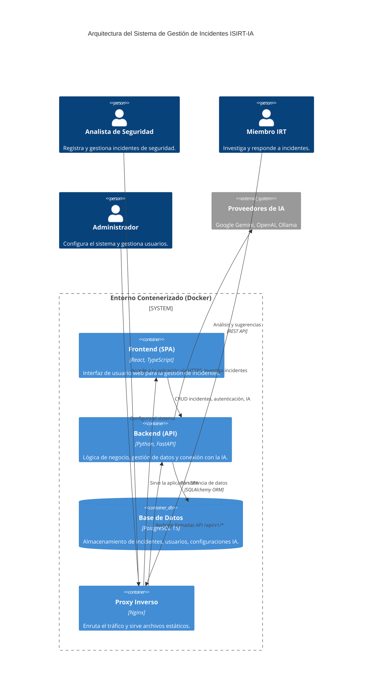
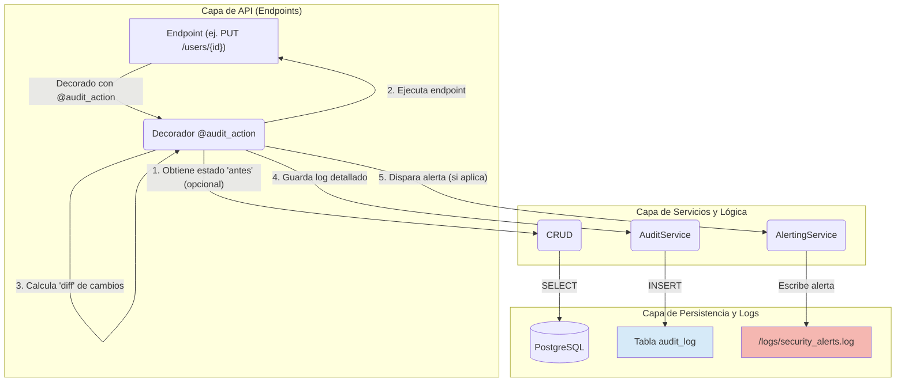
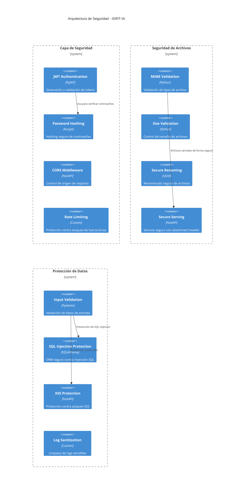
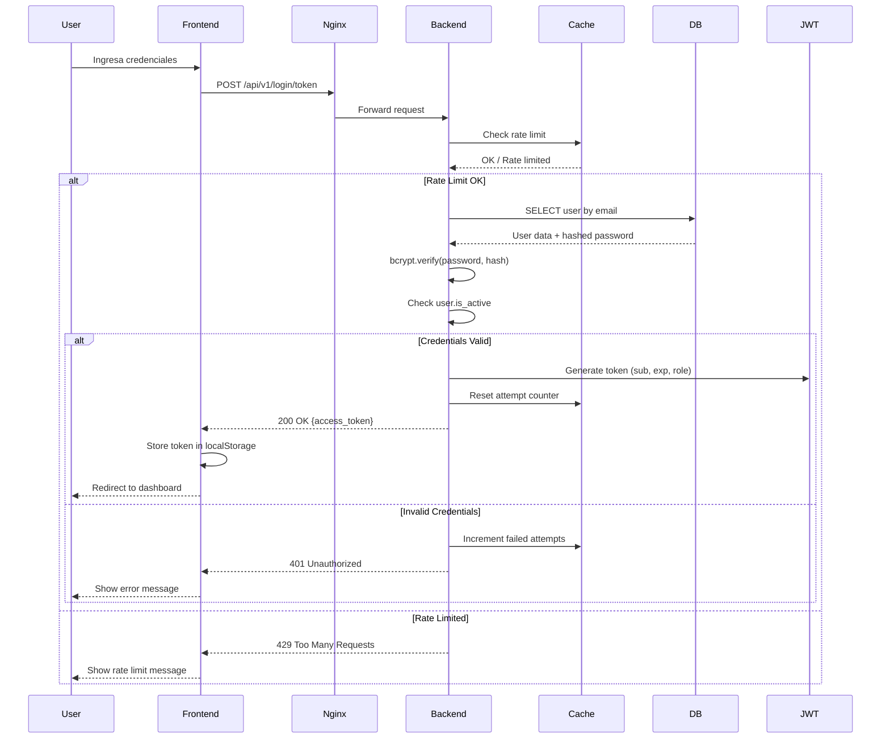
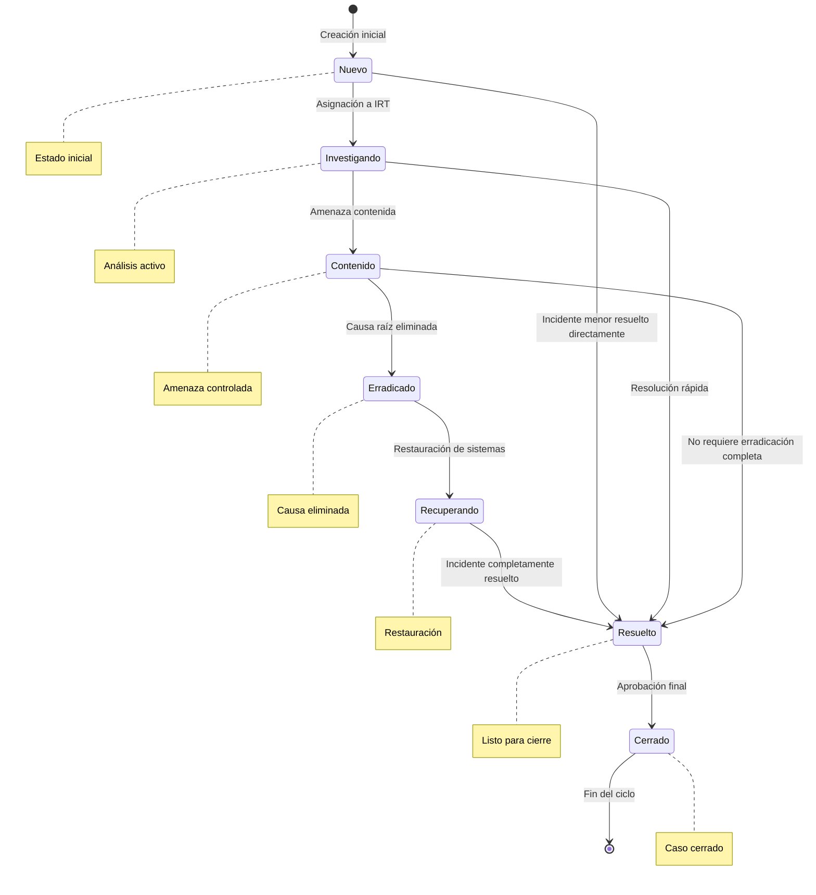

# Sistema de Gestión de Incidentes con Asistencia de IA (ISIRT-IA)

Plataforma web full-stack para la gestión centralizada de incidentes de seguridad, potenciada con un asistente de IA para acelerar el análisis y la respuesta.

## Tecnologías Clave

- **Backend:** Python, FastAPI, SQLAlchemy, Pydantic, Alembic
- **Frontend:** React, TypeScript, Vite, Tailwind CSS, Tremor
- **Base de Datos:** PostgreSQL
- **IA y RAG:** Google Gemini, OpenAI, Ollama, FAISS, LangChain
- **Contenerización:** Docker, Docker Compose, Nginx
- **Seguridad y Auditoría:** JWT (OAuth2), bcrypt, Rate Limiting, RBAC, Decoradores de Auditoría y Alertas.

## Arquitectura General

El sistema sigue una arquitectura de servicios contenerizada, donde el frontend, el backend y la base de datos operan como servicios independientes pero interconectados, orquestados por Docker Compose.

Para una descripción detallada de la arquitectura, los flujos de trabajo y los componentes, consulta el **[Documento de Arquitectura del Sistema](docs/ARQUITECTURA_SISTEMA.md)**.

### Diagrama de Contexto (C4)



## Sistema Avanzado de Auditoría y Alertas

Se ha implementado un sistema de auditoría y seguridad de nivel avanzado con los objetivos de **trazabilidad completa**, **inmutabilidad** y **monitoreo proactivo**.

### Arquitectura del Sistema de Auditoría



### Características Principales

1.  **Auditoría Declarativa con Decoradores:** Las acciones se auditan de forma limpia usando el decorador `@audit_action`, separando la lógica de seguridad del negocio.

    *Ejemplo de uso en un endpoint:*
    ```python
    @router.put("/{user_id}", response_model=schemas.UserInDB)
    @audit_action(
        action="UPDATE_USER",
        resource_type="USER",
        resource_id_param="user_id",
        get_resource_func=crud.user.get
    )
    def update_user(...):
        # ... lógica del endpoint ...
    ```

2.  **Registro Detallado de Cambios:** Para operaciones de actualización, el sistema guarda un `diff` del estado "antes" y "después" del objeto modificado.

    *Ejemplo de `details` en la base de datos:*
    ```json
    {
      "changes": {
        "old_values": {
          "role": "Miembro IRT"
        },
        "new_values": {
          "role": "Administrador"
        }
      }
    }
    ```

3.  **Alertas de Seguridad Proactivas:** Los eventos de alta prioridad se registran en un archivo `logs/security_alerts.log` para un monitoreo inmediato.

    *Ejemplo de una alerta en `security_alerts.log`:*
    ```log
    2025-10-05 20:30:00 - security_alerts - CRITICAL - SECURITY ALERT: Privilege escalation detected for user ID '123'. Role changed from 'Miembro IRT' to 'Administrador' by user 'admin@isirt.com' (ID: 1).
    ```

4.  **Inmutabilidad de Logs:** Un trigger a nivel de base de datos previene que cualquier registro en la tabla `audit_log` sea modificado o eliminado, garantizando la integridad del rastro de auditoría.

5.  **Visualizador de Logs:** Una interfaz de administrador en `/audit-logs` permite buscar, filtrar y analizar todos los registros de auditoría de forma centralizada.

## Cómo Empezar

Puedes ejecutar el proyecto de dos maneras: utilizando Docker (recomendado para un entorno consistente) o de forma local en tu máquina (ideal para desarrollo del backend).

### Opción 1: Ejecución con Docker (Recomendado)

Este método gestiona todos los servicios (backend, frontend, base de datos) de forma automática.

#### 1. Prerrequisitos

- **Docker** y **Docker Compose** instalados.

#### 2. Configuración del Entorno

Crea un archivo `.env` en la raíz del proyecto. Puedes copiar `config.dev.env` como plantilla. Asegúrate de que `DATABASE_URL` apunte al servicio de la base de datos de Docker:

```env
# Base de Datos (para Docker Compose)
DATABASE_URL="postgresql://${DB_USER}:${DB_PASSWORD}@${DB_HOST}:${DB_PORT}/${DB_NAME}"
# ... (resto de variables como SECRET_KEY, FIRST_SUPERUSER_EMAIL, etc.)
```

#### 3. Levantar la Aplicación

Desde la raíz del proyecto, ejecuta:

```bash
# Construye las imágenes y levanta los contenedores en segundo plano
docker-compose up --build -d
```

#### 4. Inicialización de la Aplicación

Una vez que los contenedores estén en funcionamiento, ejecuta el proceso de configuración inicial **dentro del contenedor del backend**:

```bash
# Accede al contenedor del backend y ejecuta el comando de setup
docker-compose exec api python manage.py initial-setup
```
La aplicación estará disponible en los puertos configurados en `docker-compose.yml`.

---

### Opción 2: Ejecución Local (para Desarrollo del Backend)

Este método te permite ejecutar el backend de FastAPI directamente en tu máquina.

#### 1. Prerrequisitos

- **Python 3.11+**
- **PostgreSQL** instalado y ejecutándose en tu máquina local.
- Un entorno virtual de Python.

#### 2. Configuración del Entorno

1.  **Crea y activa un entorno virtual:**
    ```bash
    python -m venv venv
    source venv/bin/activate  # En Windows: venv\\Scripts\\activate
    ```

2.  **Instala las dependencias:**
    ```bash
    pip install -r requirements.txt
    ```

3.  **Configura el archivo `.env`:**
    Crea un archivo `.env` en la raíz. Asegúrate de que `DATABASE_URL` apunte a tu base de datos local. Por ejemplo:
    ```env
    # Base de Datos (para ejecución local)
    DATABASE_URL="postgresql://${DB_USER}:${DB_PASSWORD}@${DB_HOST}:${DB_PORT}/${DB_NAME}"

    # ... (resto de variables)
    ```
    *Recuerda crear la base de datos `incident_db` en tu PostgreSQL local.*

#### 3. Inicialización con `manage.py`

Con el entorno virtual activado, puedes inicializar toda la aplicación (crear tablas en la BD, cargar datos maestros, etc.) con un solo comando:

```bash
python manage.py initial-setup
```

Este comando es un atajo que ejecuta los siguientes pasos en orden:
1.  Aplica las migraciones de la base de datos.
2.  Puebla la base de datos con datos maestros (categorías, tipos de activos, etc.).
3.  Crea los grupos de usuarios predeterminados.
4.  Crea el superusuario inicial (configurado en `.env`).
5.  Registra los modelos de IA disponibles.
6.  Establece la configuración predeterminada para la IA y RAG.
7.  Procesa e ingesta los `playbooks` para la base de conocimiento.

#### 4. Ejecutar el Servidor

Finalmente, puedes iniciar el servidor de desarrollo de FastAPI:
```bash
uvicorn incident_api.main:app --reload
```

## Referencia de Comandos `manage.py`

El script `manage.py` es el centro de control para tareas administrativas. Úsalo con `python manage.py [COMANDO]`.

| Comando | Descripción |
|---|---|
| `initial-setup` | **(Recomendado)** Ejecuta todos los pasos de configuración en orden. |
| `run-migrations` | Aplica las últimas actualizaciones al esquema de la base de datos. |
| `seed-data` | Puebla la BD con datos maestros iniciales (categorías, tipos, etc.). |
| `create-default-groups` | Crea los grupos de usuarios predeterminados. |
| `create-superuser` | Crea el usuario administrador con los datos del `.env`. |
| `reset-superuser` | Restablece la contraseña del superusuario. |
| `create-user` | Inicia un asistente interactivo para crear un nuevo usuario. |
| `populate-ai-models` | Registra en la BD los modelos de IA soportados. |
| `create-default-ai-settings` | Crea la configuración predeterminada de IA y RAG. |
| `ingest-playbooks` | Procesa los `playbooks` y crea el índice para RAG. |
| `test-login` | Ejecuta un conjunto de pruebas rápidas contra la API de login. |

> **Nota**: Los comandos que requieren API keys (como `ingest_playbooks`) necesitan configuración de GEMINI_API_KEY, OPENAI_API_KEY o GROQ_API_KEY en el archivo `.env`

## Diagramas de Componentes Detallados

### Arquitectura de Seguridad



### Diagrama de Secuencia - Autenticación Completa



### Diagrama de Estados - Ciclo de Vida de Incidente



## Estructura del Proyecto

```
.
├── alembic/                    # Migraciones de base de datos
├── docs/                       # Documentación del proyecto
│   ├── ARQUITECTURA_SISTEMA.md # Arquitectura completa del sistema
│   ├── DOCUMENTO_APOYO.md      # Arquitectura detallada y flujos
│   ├── DOCUMENTO_BASE_DE_DATOS.md # Esquema completo de BD
│   ├── LOGGING_MONITORING_GUIDE.md # Guía de monitoreo
│   └── LOGIN_DEBUGGING.md      # Debugging del sistema de login
├── frontend/                   # Frontend original (Vanilla JS) - Legacy
│   ├── index.html             # Página principal
│   ├── css/                   # Estilos CSS
│   ├── js/                    # Código JavaScript
│   │   ├── main.js           # Punto de entrada
│   │   ├── config.js         # Configuración frontend
│   │   ├── router.js         # Enrutamiento SPA
│   │   ├── ui.js             # Utilidades de UI
│   │   ├── api.js            # Cliente API
│   │   ├── actions/          # Acciones Redux-like
│   │   ├── components/       # Componentes reutilizables
│   │   └── utils/            # Utilidades JavaScript
├── react_frontend/            # Nuevo frontend React (TypeScript)
│   ├── src/                   # Código fuente React
│   ├── public/                # Archivos estáticos
│   ├── Dockerfile.dev         # Docker para desarrollo
│   └── package.json           # Dependencias Node.js
├── incident_api/              # Código del backend (API)
│   ├── main.py               # Punto de entrada FastAPI
│   ├── core/                 # Configuraciones centrales
│   ├── api/                  # Endpoints y dependencias
│   ├── crud/                 # Operaciones de BD
│   ├── models/               # Modelos SQLAlchemy
│   ├── schemas/              # Esquemas Pydantic
│   ├── services/             # Lógica de negocio
│   └── db/                   # Configuración de BD
├── nginx/                     # Configuración del proxy Nginx
├── playbooks/                 # Base de conocimiento para la IA
├── tests/                     # Pruebas automatizadas
├── logs/                      # Directorio de logs (creado automáticamente)
├── faiss_index/               # Índices FAISS para RAG (creado automáticamente)
├── .env                       # Variables de entorno (requerido)
├── docker-compose.yml         # Orquestación de contenedores
├── manage.py                  # Script de gestión centralizado
├── config.dev.env             # Configuración desarrollo
├── config.prod.env            # Configuración producción
├── commit_message.txt         # Borrador para mensajes de commit
└── README.md                  # Este archivo
```

## Mejoras Recientes

### 🚀 Refactorización y Mejoras de Usabilidad (Septiembre 2025)
- ✅ **Centralización de Scripts:** La lógica de `seed_data`, `test_login` y `ingest_script` ha sido consolidada en `manage.py` para un único punto de gestión.
- ✅ **Corrección de Renderizado:** Solucionado un error crítico en el frontend que impedía el renderizado de texto con formato Markdown en el chat de IA.
- ✅ **Mejora de UX:** El botón "Actualizar Incidente" ha sido reubicado en la cabecera de la página de detalles para estar siempre accesible.

### 🔧 **Sistema RAG Optimizado (Previo)**
- ✅ **Generación de índices FAISS** corregida con configuración de API keys
- ✅ **Manejo de concurrencia async** resuelto para operaciones de IA
- ✅ **Persistencia de índices** mejorada con volúmenes Docker
- ✅ **Recarga RAG desde interfaz** implementada completamente
- ✅ **Manejo de errores mejorado** con mensajes informativos

### 👥 **Gestión de Usuarios Mejorada**
- ✅ **Permisos de grupo** implementados para administradores
- ✅ **Refresco automático de datos** después de actualizaciones
- ✅ **Interfaz de usuario mejorada** con controles condicionales
- ✅ **Validación de permisos** en operaciones de grupo

### 🎨 **Frontend Optimizado**
- ✅ **Controles de UI dinámicos** basados en roles de usuario
- ✅ **Manejo de errores mejorado** con retroalimentación visual
- ✅ **Experiencia de usuario** mejorada en formularios
- ✅ **Compatibilidad de navegadores** mejorada

### 🔒 **Backend Reforzado**
- ✅ **Manejo de concurrencia** corregido en endpoints async
- ✅ **Validación de datos** mejorada en todas las capas
- ✅ **Gestión de errores** centralizada y consistente
- ✅ **Optimización de consultas** con carga de relaciones

### 📚 **Documentación Actualizada**
- ✅ **Diagramas de arquitectura** actualizados con mejoras recientes
- ✅ **Guías de configuración** ampliadas con nuevos parámetros
- ✅ **Documentación de API** mejorada con ejemplos
- ✅ **Guías de troubleshooting** actualizadas

## Solución de Problemas Comunes

### 🔧 **Problemas con el Sistema RAG**

#### **Los índices FAISS no se generan**
```bash
# Verificar que las API keys estén configuradas
cat .env | grep API_KEY

# Ejecutar la ingesta manualmente
docker compose exec api python manage.py ingest-playbooks

# (Si corres en local, ejecuta directamente: python manage.py ingest-playbooks)

# Verificar logs del proceso
docker compose logs api | grep -i rag
```

#### **Error "There is no current event loop in thread"**
- ✅ **Solucionado**: El sistema ahora maneja correctamente la concurrencia async
- Si ocurre, reinicia los contenedores: `docker compose restart`

#### **Error de permisos en /app/faiss_index**
```bash
# Corregir permisos del directorio
chmod -R 777 faiss_index

# Reiniciar contenedores
docker compose restart
```

### 👥 **Problemas de Gestión de Usuarios**

#### **El campo de grupo no se actualiza en la tabla**
- ✅ **Solucionado**: Las consultas ahora incluyen la relación de grupo
- Si persiste, refresca la página o reinicia la aplicación

#### **Permisos insuficientes para cambiar grupo**
- Solo los usuarios con rol **Administrador** pueden modificar grupos
- Verifica el rol del usuario en la tabla de usuarios

### 🔒 **Problemas de Autenticación**

#### **Error de configuración de logging**
```bash
# Crear directorio de logs
mkdir -p logs
chmod 777 logs

# Reiniciar contenedores
docker compose restart
```

### 📊 **Monitoreo y Logs**

```bash
# Ver logs de todos los servicios
docker compose logs

# Ver logs específicos del backend
docker compose logs api

# Ver logs en tiempo real
docker compose logs -f api
```

### 🚀 **Comandos Útiles**

```bash
# Reconstruir y reiniciar todo
docker compose down
docker compose up --build -d

# Acceder al contenedor del backend
docker compose exec api bash

# Ejecutar pruebas
docker compose exec api python -m pytest

# Ver estado de los contenedores
docker compose ps
```

## Documentación Adicional

- **[ARQUITECTURA_SISTEMA.md](docs/ARQUITECTURA_SISTEMA.md)**: Arquitectura completa del sistema con diagramas detallados
- **[DOCUMENTO_APOYO.md](docs/DOCUMENTO_APOYO.md)**: Arquitectura detallada y flujos de trabajo
- **[DOCUMENTO_BASE_DE_DATOS.md](docs/DOCUMENTO_BASE_DE_DATOS.md)**: Esquema completo de base de datos
- **[LOGGING_MONITORING_GUIDE.md](docs/LOGGING_MONITORING_GUIDE.md)**: Guía de monitoreo y troubleshooting
- **[LOGIN_DEBUGGING.md](docs/LOGIN_DEBUGGING.md)**: Debugging específico del sistema de login
- **[🎨 Frontend React](react_frontend/README.md)**: Documentación del nuevo frontend React/TypeScript
- **[🔧 Backend API](incident_api/README.md)**: Documentación completa del backend FastAPI
- **[📚 Gestión RAG](docs/GUIA_GESTION_CONOCIMIENTO_RAG.md)**: Guía de gestión del conocimiento RAG
- **[💬 Prompts IA](docs/prompts.md)**: Prompts recomendados para el sistema de IA

## Licencia

Este proyecto está bajo la Licencia **GNU General Public License v3.0 (GPLv3)**. Consulta el archivo [LICENSE](LICENSE) para más detalles.
