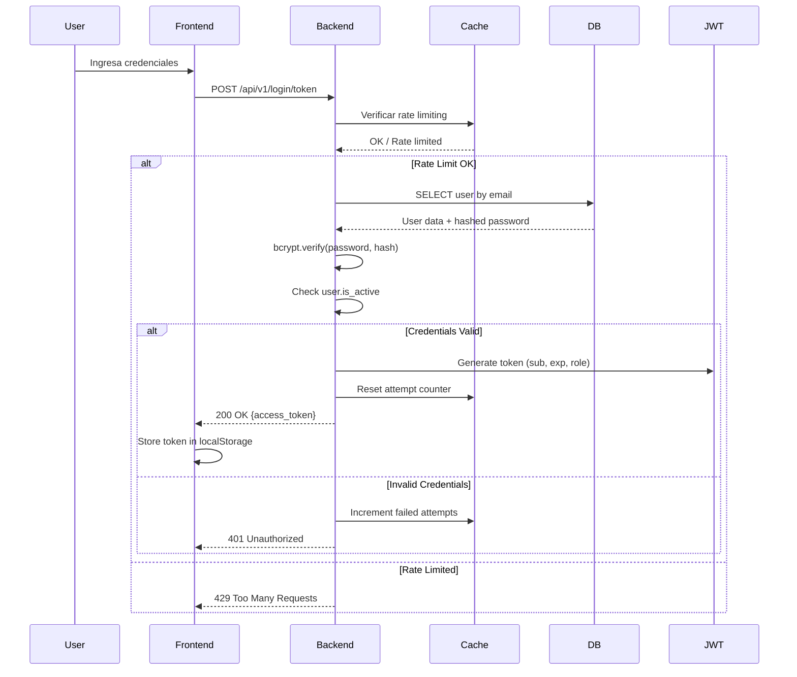
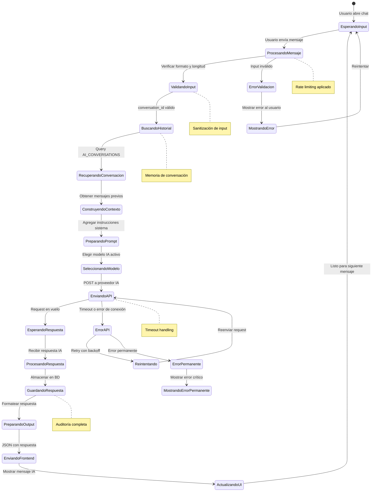

# 🔧 Backend API - Sistema ISIRT-IA

**API RESTful de alto rendimiento** construida con **Python 3.13** y **FastAPI** para el Sistema de Gestión de Incidentes con Asistencia de IA. Arquitectura robusta, escalable y segura siguiendo las mejores prácticas de desarrollo backend moderno.

## 🎯 Características Principales

### Arquitectura y Framework
- **🚀 FastAPI**: Framework moderno con documentación automática (Swagger/ReDoc)
- **📋 Pydantic**: Validación automática de datos y serialización
- **🗄️ SQLAlchemy**: ORM potente para PostgreSQL con Alembic migrations
- **🔐 OAuth2/JWT**: Autenticación segura con tokens JWT
- **⚡ Async/Await**: Soporte completo para operaciones asíncronas

### Inteligencia Artificial Integrada
- **🤖 Modelos IA Múltiples**: Gemini, OpenAI, Ollama, Groq
- **📚 RAG System**: Retrieval-Augmented Generation con FAISS
- **💬 Chatbot Context-Aware**: Conversaciones con memoria histórica
- **🎯 Análisis Inteligente**: Sugerencias automáticas para incidentes

### Seguridad y Rendimiento
- **🔒 Rate Limiting**: Protección contra ataques de fuerza bruta
- **🛡️ CORS Configurado**: Control de origen de requests
- **📝 Logging Estructurado**: Monitoreo completo con sanitización
- **⚡ Caching**: Redis opcional para optimización
- **📊 Métricas**: Monitoreo de rendimiento y errores

### Despliegue y DevOps
- **🐳 Docker**: Contenerización completa
- **🔄 Hot Reload**: Desarrollo con recarga automática
- **📚 Documentación**: API docs autogeneradas
- **🧪 Testing**: Framework de pruebas configurado

## 🏗️ Arquitectura por Capas

```mermaid
C4Container
  title Arquitectura por Capas - Backend ISIRT-IA

  Container_Boundary(api_layer, "Capa de API") {
    Container(endpoints, "Endpoints REST", "FastAPI", "Exponen operaciones CRUD y IA")
    Container(dependencies, "Dependencias", "FastAPI", "Autenticación, validación, inyección")
    Container(middleware, "Middleware", "FastAPI", "CORS, logging, error handling")
    Container(security, "Seguridad", "FastAPI", "JWT, rate limiting, file security")
  }

  Container_Boundary(service_layer, "Capa de Servicios") {
    Container(incident_svc, "IncidentService", "Python", "Lógica de negocio de incidentes")
    Container(ai_svc, "AIService", "Python", "Integración con modelos de IA")
    Container(user_svc, "UserService", "Python", "Gestión de usuarios y autenticación")
    Container(rag_svc, "RAGService", "Python", "Procesamiento de documentos")
    Container(chat_svc, "ChatService", "Python", "Sistema de conversación con IA")
  }

  Container_Boundary(data_layer, "Capa de Datos") {
    Container(crud_ops, "CRUD Operations", "SQLAlchemy", "Operaciones de BD")
    Container(models, "Modelos", "SQLAlchemy", "Definición de tablas")
    Container(schemas, "Esquemas", "Pydantic", "Validación y serialización")
    Container(migrations, "Alembic", "Migraciones", "Versionado de esquema BD")
  }

  Container_Boundary(infra_layer, "Capa de Infraestructura") {
    ContainerDb(postgres, "PostgreSQL", "Base de datos")
    Container(faiss, "FAISS Index", "Búsqueda vectorial")
    Container(redis, "Redis Cache", "Caché opcional")
    Container(filesystem, "File System", "Archivos de evidencia")
  }

  Rel(endpoints, incident_svc, "Orquesta operaciones")
  Rel(endpoints, ai_svc, "Invoca análisis IA")
  Rel(endpoints, user_svc, "Gestiona autenticación")
  Rel(endpoints, chat_svc, "Maneja conversaciones IA")

  Rel(incident_svc, crud_ops, "Persistencia")
  Rel(ai_svc, rag_svc, "Enriquecimiento contextual")
  Rel(chat_svc, crud_ops, "Historial de conversaciones")

  Rel(crud_ops, models, "ORM mapping")
  Rel(crud_ops, postgres, "SQL queries")
  Rel(crud_ops, migrations, "Schema versioning")

  Rel(rag_svc, faiss, "Índice vectorial")
  Rel(ai_svc, gemini, "API externa", "system")
  Rel(security, filesystem, "Archivos seguros")
```

## 🔄 Flujos de Trabajo Principales

### 1. Autenticación Completa con Rate Limiting



### 2. Creación de Incidente con IA y RAG

```mermaid
flowchart TD
    A[Usuario describe incidente] --> B{Validar entrada con Pydantic}
    B --> C[Enviar a /incidents/suggestions]

    C --> D{Backend recibe solicitud}
    D --> E[Extraer descripción del incidente]

    E --> F{ai_service.get_incident_enrichment}
    F --> G[Buscar en índice FAISS - RAG]
    G --> H[Recuperar chunks relevantes de playbooks]

    H --> I[Construir prompt enriquecido con contexto]
    I --> J[Enviar a modelo IA activo (Gemini/OpenAI/Ollama)]
    J --> K{Procesar respuesta JSON}

    K --> L[Extraer sugerencias: categoría, tipo, severidad]
    L --> M[Generar recomendaciones automáticas]

    M --> N{Validar sugerencias}
    N --> O[Devolver sugerencias al frontend]

    O --> P[Usuario revisa sugerencias]
    P --> Q{Usuario acepta/modifica}

    Q --> R[Enviar formulario completo]
    R --> S[POST /incidents/ con datos validados]

    S --> T{incident_service.create_incident}
    T --> U[Crear registro en BD con transacción]
    U --> V[Asociar archivos de evidencia]
    V --> W[Registrar en bitácora con audit trail]

    W --> X[Enriquecer con IA si falla creación]
    X --> Y[Devolver incidente creado con ID]

    Y --> Z[Frontend muestra confirmación]
    Z --> AA[Usuario puede gestionar incidente]

    style A fill:#e3f2fd
    style G fill:#f3e5f5
    style J fill:#e8f5e8
    style T fill:#fff3e0
```

### 3. Sistema de Chatbot con Memoria



### 4. Gestión Segura de Archivos

```mermaid
flowchart TD
    A[Usuario selecciona archivo] --> B{Validación frontend}
    B --> C[Tipo MIME permitido?]
    C -->|No| D[Mostrar error - tipo inválido]
    C -->|Sí| E[Tamaño < límite?]

    E -->|No| F[Mostrar error - archivo demasiado grande]
    E -->|Sí| G[Enviar FormData a /incidents/]

    G --> H{Backend recibe upload}
    H --> I[Validar tipo MIME en servidor]
    I --> J[Verificar tamaño de archivo]
    J --> K[Verificar permisos de usuario]

    K --> L[Generar nombre seguro con UUID]
    L --> M[Guardar en directorio uploads/]
    M --> N[Crear registro en evidence_files]

    N --> O[Asociar con incidente]
    O --> P[Registrar en bitácora de auditoría]

    P --> Q[Devolver URL segura al frontend]
    Q --> R[Frontend muestra enlace de descarga]

    R --> S[Usuario hace clic en descarga]
    S --> T[GET /secure-uploads/{file_path}]
    T --> U{Validar autenticación y permisos}
    U --> V[Verificar acceso al archivo]
    V --> W[Servir con Content-Disposition: attachment]

    W --> X[Descarga segura del archivo]

    D --> Y[Error handling]
    F --> Y
    Y --> A

    I --> Z[Error: tipo inválido]
    J --> AA[Error: tamaño excedido]
    K --> BB[Error: permisos insuficientes]
    U --> CC[Error: acceso denegado]
    V --> DD[Error: archivo no encontrado]

    Z --> Y
    AA --> Y
    BB --> Y
    CC --> Y
    DD --> Y

    style A fill:#e3f2fd
    style L fill:#f3e5f5
    style T fill:#e8f5e8
    style W fill:#fff3e0
```

## 🛠️ Tecnologías y Dependencias

### Core Framework
| Componente | Tecnología | Versión | Propósito |
|------------|------------|---------|-----------|
| **Lenguaje** | Python | 3.13.7 | Lenguaje principal |
| **Framework Web** | FastAPI | 0.115+ | API REST moderna |
| **Servidor ASGI** | Uvicorn | 0.32+ | Servidor de alto rendimiento |
| **Validación** | Pydantic | 2.9+ | Validación y serialización |

### Base de Datos y ORM
| Componente | Tecnología | Versión | Propósito |
|------------|------------|---------|-----------|
| **Base de Datos** | PostgreSQL | 15+ | Base de datos relacional |
| **ORM** | SQLAlchemy | 2.0+ | Mapeo objeto-relacional |
| **Migraciones** | Alembic | 1.13+ | Versionado de esquema |

### Seguridad y Autenticación
| Componente | Tecnología | Versión | Propósito |
|------------|------------|---------|-----------|
| **JWT** | PyJWT | 2.9+ | Tokens de autenticación |
| **Hashing** | bcrypt | 4.2+ | Hashing de contraseñas |
| **Rate Limiting** | Custom | - | Protección contra ataques |

### Inteligencia Artificial
| Componente | Tecnología | Versión | Propósito |
|------------|------------|---------|-----------|
| **Gemini** | google-generativeai | 0.8+ | Modelo IA principal |
| **OpenAI** | openai | 1.51+ | Modelo alternativo |
| **Ollama** | requests | - | Modelos locales |
| **FAISS** | faiss-cpu | 1.8+ | Búsqueda vectorial |
| **Groq** | groq | 0.11+ | Modelo de alto rendimiento |

### Desarrollo y Testing
| Componente | Tecnología | Versión | Propósito |
|------------|------------|---------|-----------|
| **Testing** | pytest | 8.3+ | Framework de pruebas |
| **Linting** | flake8 | 7.1+ | Análisis de código |
| **Type Hints** | mypy | 1.11+ | Verificación de tipos |

## ⚙️ Configuración del Sistema

### Variables de Entorno Requeridas

```bash
# Base de Datos
DATABASE_URL=postgresql://${DB_USER}:${DB_PASSWORD}@${DB_HOST}:${DB_PORT}/${DB_NAME}/incident_db

# Seguridad JWT
SECRET_KEY=tu_clave_secreta_aqui_de_32_caracteres_minimo
ACCESS_TOKEN_EXPIRE_MINUTES=30

# Superusuario Inicial
FIRST_SUPERUSER_EMAIL=admin@isirt.com
FIRST_SUPERUSER_PASSWORD=tu_password_seguro
FIRST_SUPERUSER_FULL_NAME=Administrador Sistema

# APIs de IA (al menos una requerida)
GEMINI_API_KEY=tu_api_key_de_google_gemini
OPENAI_API_KEY=tu_api_key_de_openai
GROQ_API_KEY=tu_api_key_de_groq

# Configuración de Ollama (opcional)
OLLAMA_API_BASE_URL=http://localhost:11434

# Configuración de Archivos
ALLOWED_FILE_MIME_TYPES=image/jpeg,image/png,application/pdf,text/plain
MAX_FILE_SIZE_MB=5

# Configuración de Logging
LOG_LEVEL=INFO
LOG_FORMAT=json

# Configuración de Rate Limiting
LOGIN_MAX_ATTEMPTS=5
LOGIN_LOCKOUT_MINUTES=15
LOGIN_RATE_LIMIT_REQUESTS=10
LOGIN_RATE_LIMIT_WINDOW_MINUTES=5

# Configuración de CORS
CORS_ORIGINS=http://localhost:8080,http://localhost:3000
```

### Configuración por Entorno

#### Desarrollo (`config.dev.env`)
```bash
DEBUG=true
LOG_LEVEL=DEBUG
ACCESS_TOKEN_EXPIRE_MINUTES=60
LOGIN_MAX_ATTEMPTS=10
CORS_ORIGINS=http://localhost:8080,http://localhost:3000,http://localhost:5173
```

#### Producción (`config.prod.env`)
```bash
DEBUG=false
LOG_LEVEL=WARNING
ACCESS_TOKEN_EXPIRE_MINUTES=15
LOGIN_MAX_ATTEMPTS=3
CORS_ORIGINS=https://tu-dominio.com
```

## 🚀 Despliegue y Ejecución

### Opción 1: Docker Compose (Recomendado)

```bash
# Construir y levantar todos los servicios
docker-compose up --build -d

# Ver logs en tiempo real
docker-compose logs -f backend

# Acceder al contenedor
docker-compose exec backend bash

# Ejecutar comandos de gestión
python manage.py initial_setup
```

### Opción 2: Desarrollo Local

```bash
# Instalar dependencias
pip install -r requirements.txt

# Configurar variables de entorno
cp .env.example .env
# Editar .env con tus valores

# Ejecutar migraciones
alembic upgrade head

# Iniciar servidor con hot reload
uvicorn incident_api.main:app --reload --host 0.0.0.0 --port 8000
```

### Verificación del Despliegue

```bash
# Health check
curl http://localhost:8000/health

# Documentación API
# Swagger: http://localhost:8000/docs
# ReDoc: http://localhost:8000/redoc

# Logs del contenedor
docker logs fastapi_api
```

## 📁 Estructura Detallada del Proyecto

```
incident_api/
├── 📄 main.py                    # 🚀 Punto de entrada FastAPI
├── 📁 ai/                        # 🤖 Lógica de IA y RAG
│   ├── __init__.py
│   ├── llm_factory.py           # 🏭 Factory para modelos IA
│   ├── rag_processor.py         # 📚 Procesador RAG con FAISS
│   └── connectors/              # 🔌 Conectores para proveedores IA
├── 📁 api/                       # 🌐 Capa de API REST
│   ├── __init__.py
│   ├── api.py                   # 🗂️ Router principal
│   ├── dependencies.py          # 🔗 Dependencias FastAPI
│   └── v1/                      # 📋 Versionado de API
│       └── endpoints/           # 🎯 Endpoints específicos
│           ├── __init__.py
│           ├── incidents.py     # 🚨 Gestión de incidentes
│           ├── users.py         # 👥 Gestión de usuarios
│           ├── chatbot.py       # 💬 Sistema de chatbot IA
│           ├── ai_settings.py   # ⚙️ Configuración IA
│           └── rag_settings.py  # 📖 Configuración RAG
├── 📁 core/                      # ⚙️ Configuración central
│   ├── __init__.py
│   ├── config.py                # 🔧 Configuración Pydantic
│   ├── security.py              # 🔒 Utilidades de seguridad
│   ├── hashing.py               # 🔐 Hashing de contraseñas
│   ├── logging_config.py        # 📝 Configuración de logging
│   └── utils.py                 # 🛠️ Utilidades generales
├── 📁 crud/                      # 💾 Operaciones CRUD
│   ├── __init__.py
│   ├── base.py                  # 🔧 Clase base CRUD
│   ├── crud_user.py             # 👤 CRUD usuarios
│   ├── crud_incident.py         # 🚨 CRUD incidentes
│   ├── crud_ai_settings.py      # 🤖 CRUD configuración IA
│   ├── crud_rag_settings.py     # 📚 CRUD configuración RAG
│   └── crud_available_ai_model.py # 📋 CRUD modelos disponibles
├── 📁 db/                        # 🗄️ Configuración BD
│   ├── __init__.py
│   ├── base.py                  # 🔧 Base declarativa
│   └── database.py              # 🔌 Sesión de BD
├── 📁 models/                    # 📊 Modelos SQLAlchemy
│   ├── __init__.py
│   ├── user.py                  # 👤 Modelo usuario
│   ├── incident.py              # 🚨 Modelo incidente
│   ├── ai.py                    # 🤖 Modelos IA
│   ├── asset.py                 # 💼 Modelo activos
│   ├── attack_vector.py         # 🎯 Modelo vectores ataque
│   └── history.py               # 📜 Modelo historial
├── 📁 schemas/                   # 📋 Esquemas Pydantic
│   ├── __init__.py
│   ├── user.py                  # 👤 Esquemas usuario
│   ├── incident.py              # 🚨 Esquemas incidente
│   ├── ai_settings.py           # 🤖 Esquemas configuración IA
│   ├── chatbot.py               # 💬 Esquemas chatbot
│   └── dialogue_summary.py      # 📝 Esquemas resumen diálogo
├── 📁 services/                  # 🔧 Lógica de negocio
│   ├── __init__.py
│   ├── user_service.py          # 👥 Servicio usuarios
│   ├── incident_service.py      # 🚨 Servicio incidentes
│   ├── ai_service.py            # 🤖 Servicio IA
│   ├── chat_service.py          # 💬 Servicio chatbot
│   ├── incident_analysis_service.py # 📊 Servicio análisis
│   └── rag_service.py           # 📚 Servicio RAG
└── 📁 security/                  # 🔐 Módulos de seguridad
    └── __init__.py
```

## 📚 Documentación Relacionada

Para información más detallada sobre el sistema completo:

- **[📋 Documentación Principal](../../README.md)**: Arquitectura general del sistema
- **[🏗️ Arquitectura del Sistema](../../docs/ARQUITECTURA_SISTEMA.md)**: Arquitectura completa con diagramas detallados
- **[🎨 Frontend](../../frontend/README.md)**: Documentación del frontend SPA
- **[🔧 Guía de Desarrollo](../../docs/DOCUMENTO_APOYO.md)**: Desarrollo del backend API
- **[🗄️ Esquema de Base de Datos](../../docs/DOCUMENTO_BASE_DE_DATOS.md)**: Modelo de datos completo
- **[📊 Guía de Monitoreo](../../docs/LOGGING_MONITORING_GUIDE.md)**: Logging y monitoreo del sistema
- **[🔍 Debugging de Login](../../docs/LOGIN_DEBUGGING.md)**: Troubleshooting del sistema de autenticación

## 🧪 Testing y Calidad

### Ejecutar Tests
```bash
# Tests unitarios
pytest tests/ -v

# Tests con cobertura
pytest tests/ --cov=incident_api --cov-report=html

# Tests específicos
pytest tests/test_user.py -v
pytest tests/test_incident.py -v
```

### Linting y Formateo
```bash
# Verificar estilo de código
flake8 incident_api/

# Verificar tipos (si está configurado)
mypy incident_api/
```

## 🔧 Mejoras Recientes (Septiembre 2025)

### Sistema RAG Optimizado
- ✅ **Generación de índices FAISS** corregida con configuración de API keys
- ✅ **Manejo de concurrencia async** resuelto para operaciones de IA
- ✅ **Persistencia de índices** mejorada con volúmenes Docker
- ✅ **Recarga RAG desde interfaz** implementada completamente
- ✅ **Manejo de errores mejorado** con mensajes informativos

### Gestión de Usuarios Mejorada
- ✅ **Permisos de grupo** implementados para administradores
- ✅ **Refresco automático de datos** después de actualizaciones
- ✅ **Interfaz de usuario mejorada** con controles condicionales
- ✅ **Validación de permisos** en operaciones de grupo
- ✅ **Carga de relaciones** optimizada en consultas de BD

### Backend Reforzado
- ✅ **Manejo de concurrencia** corregido en endpoints async
- ✅ **Validación de datos** mejorada en todas las capas
- ✅ **Gestión de errores** centralizada y consistente
- ✅ **Optimización de consultas** con carga de relaciones
- ✅ **Logging mejorado** con configuración de archivos

## 🔧 Comandos de Gestión

### Setup Inicial
```bash
# Configuración completa del sistema
python manage.py initial_setup

# O ejecutar por separado:
python manage.py run_migrations      # Migraciones BD
python manage.py seed_data          # Datos maestros
python manage.py create_superuser   # Usuario admin
python manage.py populate_ai_models # Modelos IA
python manage.py ingest_playbooks   # Indexar documentos
```

### Gestión de Usuarios
```bash
# Crear superusuario
python manage.py create_superuser

# Crear usuario interactivo
python manage.py create_user

# Resetear contraseña superusuario
python manage.py reset_superuser
```

### Gestión de IA
```bash
# Poblar modelos disponibles
python manage.py populate_ai_models

# Indexar documentos para RAG
python manage.py ingest_playbooks
```

## 📊 Monitoreo y Métricas

### Endpoints de Monitoreo
- **Health Check**: `GET /health`
- **API Docs**: `GET /docs` (Swagger)
- **API Schema**: `GET /openapi.json`

### Logs del Sistema
```bash
# Ver logs en tiempo real
docker logs -f fastapi_api

# Logs con filtrado
docker logs fastapi_api | grep ERROR
docker logs fastapi_api | grep "POST /api/v1/login"
```

### Métricas de Rendimiento
- **Response Times**: Monitorear latencia de endpoints
- **Database Queries**: Número y tiempo de queries
- **AI API Calls**: Uso de tokens y tiempos de respuesta
- **Error Rates**: Tasas de error por endpoint

## 🤝 Contribuciones

### Estándares de Desarrollo
- **Type Hints**: Usar anotaciones de tipo en todas las funciones
- **Docstrings**: Documentar todas las funciones públicas
- **Logging**: Usar logging estructurado en lugar de print
- **Error Handling**: Manejar errores apropiadamente con excepciones custom
- **Testing**: Escribir tests para nueva funcionalidad

### Proceso de Desarrollo
1. **Fork** del repositorio
2. **Branch** para nueva funcionalidad: `git checkout -b feature/nueva-funcionalidad`
3. **Commits** siguiendo conventional commits
4. **Pull Request** con descripción detallada
5. **Code Review** y aprobación
6. **Merge** a rama principal

---

**Última actualización**: Septiembre 2025
**Versión del API**: 1.1.0
**Framework**: FastAPI + SQLAlchemy
**Estado**: ✅ Producción Ready

**Últimas mejoras**:
- Sistema RAG completamente funcional con recarga desde interfaz
- Gestión de usuarios mejorada con permisos de grupo
- Optimización de consultas de base de datos con carga de relaciones
- Manejo de concurrencia async corregido
- Logging mejorado con configuración de archivos